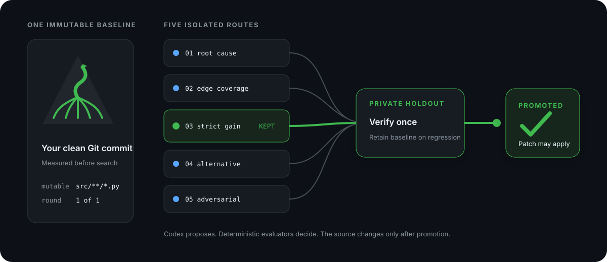

<div align="center">
  

  <h1>Let five Codex agents compete. Ship only the verified winner.</h1>

  <p><strong>Hill Climber runs five isolated attempts from the same Git commit, grades every route, verifies one winner on a private holdout, and applies only the promoted patch.</strong></p>

  <p>
    <a href="https://github.com/ali-abassi/hill-climber/actions/workflows/test.yml"></a>
    <a href="LICENSE"></a>
  </p>

  <p>
    <a href="#quickstart">Quickstart</a> ·
    <a href="#how-the-climb-works">How it works</a> ·
    <a href="#commands">Commands</a> ·
    <a href="#when-to-use-it">When to use it</a> ·
    <a href="#security-boundary">Security</a> ·
    <a href="SKILL.md">Agent skill</a>
  </p>

  
</div>

## Why does this exist?

Autonomous coding loops often blur the roles that should stay separate:

- the same agent proposes a change and declares it better;
- sequential attempts overwrite each other, making comparison unreliable;
- visible tests become the target, while hidden regressions go unnoticed;
- interruption means starting over—or guessing what already ran.

Hill Climber makes the model the **candidate generator**, not the judge. A local
controller owns the baseline, isolated worktrees, scoring, selection, budgets,
private holdout, recovery, and final application.

## Quickstart

### Prove the engine locally—no API key or subscription usage

```bash
git clone https://github.com/ali-abassi/hill-climber.git
cd hill-climber
npm ci
./examples/demo.sh
```

Real output from the deterministic demo:

```text
Hill Climber demo
status: promoted
candidates: 5
baseline: 0
final: 5
holdout: promoted
applied: yes
```

### Install the real CLI

```bash
codex login
./install.sh
hill-climber --version
```

```text
hill-climber 0.2.0
```

The installer uses the ChatGPT subscription already authenticated by the Codex
CLI, downloads two pinned Node dependencies, and links `hill-climber` into
`~/.local/bin`. It does not require an OpenAI API key or `sudo`.

### Run your first climb

```bash
hill-climber run \
  --workspace /absolute/path/to/your-repo \
  --task "Make parse_duration strict and support compound durations" \
  --details-file /absolute/path/to/task.md \
  --eval "python3 /absolute/evals/dev_evaluator.py" \
  --holdout-eval "python3 /absolute/private/holdout_evaluator.py" \
  --mutable "src/**/*.py" \
  --candidates 5 \
  --rounds 1 \
  --out /tmp/duration-climb \
  --no-apply
```

Start with `--no-apply`. The promoted patch and full evidence stay in the
experiment directory, while your source checkout remains unchanged.

Each evaluator runs from a detached candidate checkout and prints exactly one
JSON object:

```json
{
  "score": 0.85,
  "gates": {"tests": true, "lint": true},
  "details": "17 of 20 behavioral cases passed"
}
```

Higher scores are better; every gate must pass. Keep holdout code and data
outside the repository and never reveal its cases through prompts, setup, or
development diagnostics. See the
[starter evaluator](examples/binary_command_evaluator.py) for the smallest
working contract.

## How the climb works

1. **Measure base camp.** Grade the untouched commit through the same
   development evaluator path used for candidates.
2. **Open five routes.** Start five fresh Codex SDK threads—root cause, edge
   coverage, simplification, alternative design, and adversarial hardening.
3. **Keep routes isolated.** Each candidate writes to its own Git worktree;
   authored changes outside `--mutable` invalidate it.
4. **Grade away from the agent.** Commit the candidate, remove its generation
   worktree, then evaluate that commit in a separate detached worktree.
5. **Choose one strict gain.** Gates, score, repeat floor, changed-line count,
   and stable candidate ID determine one deterministic round winner.
6. **Verify the summit once.** After search ends, compare baseline and winner on
   the private holdout. A regression retains the baseline.
7. **Apply only after promotion.** With `--apply`, the controller patches the
   still-clean source only after holdout success.

Interrupted rounds reuse committed artifacts. If interruption happens after
the holdout begins, that holdout is closed and never replayed.

## Commands

| You want to… | Run |
|---|---|
| Start a bounded search | `hill-climber run …` |
| Verify current state | `hill-climber status EXPERIMENT --json` |
| Read the receipt | `hill-climber inspect EXPERIMENT --json` |
| Inspect one route | `hill-climber inspect EXPERIMENT --candidate r01-c03 --json` |
| Stop after the current safe boundary | `hill-climber stop EXPERIMENT --json` |
| Continue unfinished work | `hill-climber resume EXPERIMENT` |

Ctrl-C checkpoints the run and prints the exact resume command. With `--json`,
stdout contains one machine document while progress stays on stderr.

## Compatibility

| Surface | Verified |
|---|---|
| macOS local CLI | Node 26, Python 3.14, Git, Codex CLI subscription login |
| GitHub Actions | Ubuntu, Node 20, Python 3.12 |
| Codex SDK | `@openai/codex-sdk` 0.149.0, pinned |
| Evaluators | Any trusted local executable that returns the JSON contract |

The intended floor is Node 18+, Python 3.9+, Git, and a Codex CLI session that
reports `Logged in using ChatGPT`. Windows-native and remote/SSH operation have
not been certified.

## When to use it

| Choose | When it wins | Tradeoff |
|---|---|---|
| **Hill Climber** | You have a measurable code objective, narrow mutable files, and a private regression set | Requires thoughtful evaluators; five candidates consume more subscription capacity |
| **Manual Codex** | The task is exploratory, subjective, or needs constant human steering | Human owns comparison, rollback, and experiment memory |
| **autoresearch-style prompt loop** | You want the smallest possible sequential research protocol | The prompt, not an executable controller, owns keep/revert and resume discipline |
| **A custom eval platform** | You need distributed workers, OS isolation, spend accounting, or organization-wide policy | More infrastructure and integration work |

Do not use Hill Climber when quality cannot be scored externally, the target
repository is dirty, evaluator commands are untrusted, or the necessary edit
surface cannot be bounded.

## Under the hood

- immutable incumbents and separate Git worktrees;
- five strategy lanes per default round, with bounded concurrency;
- detached development grading and a one-time private holdout;
- repeat seeds, gates, minimum gain, target, plateau, wall, token, and failure
  budgets;
- fsynced atomic state plus a hash-chained event ledger;
- durable prompts, SDK traces, patches, evaluator records, failures, and receipt;
- environment allowlisting for cached subscription auth without forwarding
  arbitrary caller secrets;
- no controller-owned commit to your branch, push, merge, deployment, or
  destructive reset.

## Evidence

The committed deterministic suite covers:

- easy, medium, and hard runs with exactly five candidates each;
- development overfitting rejected by a hidden holdout;
- interrupted-round recovery without duplicate generation or grading;
- interrupted holdout closure without replay;
- distinct dirty-tree, authentication, SDK, and evaluator failures;
- manifest, state, and ledger tamper rejection.

The current public CI runs all seven lifecycle tests plus syntax checks and a
production dependency audit. That evidence validates the controller protocol;
it does **not** guarantee improvement on an arbitrary repository or evaluator.

## Security boundary

Candidate Codex threads request workspace-only writes, no approvals, no web
search, and network disabled through SDK options. Mutable Git diffs are checked
again by the controller.

Evaluator and setup commands are different: they are trusted local programs
that execute with your user authority. Hill Climber is **not an OS-level
sandbox**. Put unknown repositories, installers, or graders inside a container
or VM appropriate to their risk. Read [SECURITY.md](SECURITY.md) before using it
on sensitive code.

## Project

[Agent operating skill](SKILL.md) · [Security](SECURITY.md) ·
[Design and research](docs/design.md) · [Contributing](CONTRIBUTING.md) ·
[Changelog](CHANGELOG.md) · [MIT license](LICENSE)
