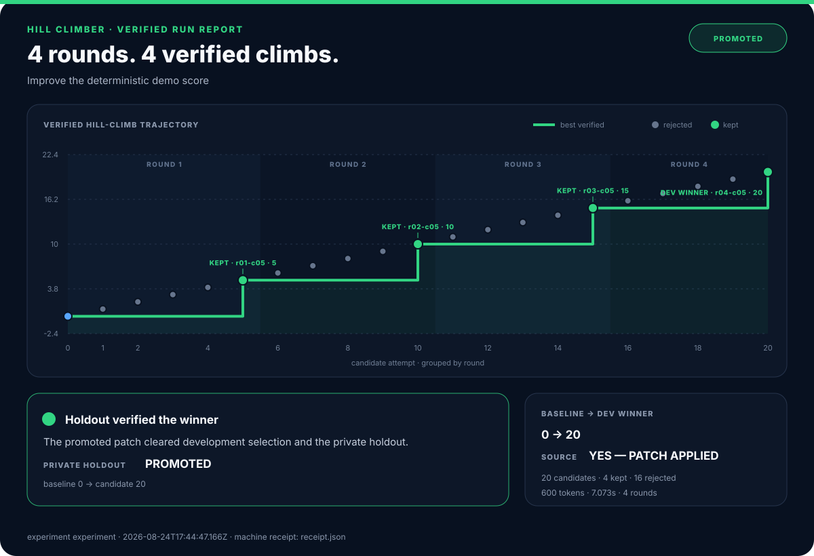
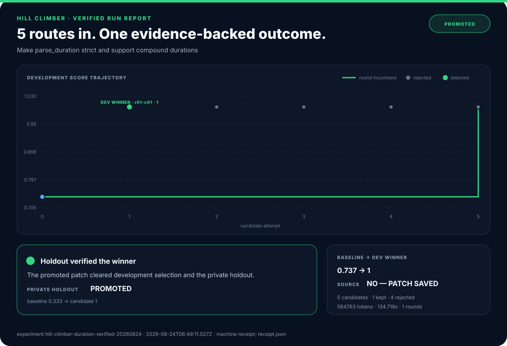

<div align="center">
  

  <h1>Turn code changes into measured experiments.</h1>

  <p><strong>Hill Climber gives Codex a measurable repository goal, runs competing patches in isolated Git worktrees, plots every score, verifies the best strict gain on unseen cases, and applies only a promoted patch.</strong></p>

  <p>
    <a href="https://github.com/ali-abassi/hill-climber/actions/workflows/test.yml"></a>
    <a href="LICENSE"></a>
  </p>

  <p>
    <a href="#quickstart">Quickstart</a> ·
    <a href="#how-the-climb-works">How it works</a> ·
    <a href="#benchmark-receipt">Benchmark</a> ·
    <a href="#commands">Commands</a> ·
    <a href="#when-to-use-it">When to use it</a> ·
    <a href="#security-boundary">Security</a> ·
    <a href="SKILL.md">Agent skill</a>
  </p>

  

  <p><sub>Deterministic protocol receipt: 20 isolated candidates across four rounds; verified incumbent 0 → 5 → 10 → 15 → 20. The real Codex benchmark remains disclosed below.</sub></p>
</div>

## Why does this exist?

“Make this code better” is not an evaluation method. Autonomous coding loops
often blur roles that should stay separate:

- the same agent proposes a change and declares it better;
- sequential attempts overwrite each other, making comparison unreliable;
- visible tests become the target, while hidden regressions go unnoticed;
- interruption means starting over—or guessing what already ran.

Hill Climber makes the model the **candidate generator**, not the judge. You
define the metric and unseen cases. A local controller measures the untouched
baseline, isolates each patch, keeps only strict gains, verifies the selected
patch once more, and preserves the complete experiment trace.

## Quickstart

### Prove the controller locally—no API key or subscription usage

```bash
git clone https://github.com/ali-abassi/hill-climber.git
cd hill-climber
npm ci
./examples/demo.sh
```

The demo substitutes a deterministic fake candidate generator so you can test
the controller, report, and apply boundary without spending subscription
capacity. Real output:

```text
Hill Climber demo
status: promoted
candidates: 20
rounds: 4
baseline: 0
final: 20
holdout: promoted
applied: yes
report: generated
```

### Install the real CLI

```bash
codex login
./install.sh
hill-climber --version
```

```text
hill-climber 0.4.0
```

The installer uses the ChatGPT subscription already authenticated by the Codex
CLI, downloads two pinned Node dependencies, and links `hill-climber` into
`~/.local/bin`. It does not require an OpenAI API key or `sudo`.

### Run your first climb

```bash
hill-climber run \
  --workspace /absolute/path/to/your-repo \
  --task "Make parse_duration strict and support compound durations" \
  --details-file /absolute/path/to/task.md \
  --eval "python3 /absolute/evals/dev_evaluator.py" \
  --holdout-eval "python3 /absolute/private/holdout_evaluator.py" \
  --mutable "src/**/*.py" \
  --candidates 5 \
  --rounds 3 \
  --plateau-rounds 2 \
  --out /tmp/duration-climb \
  --no-apply
```

Start with `--no-apply`. A promoted `winner.patch`, score-trajectory
`report.svg`, and machine `receipt.json` stay in the experiment directory while
your source checkout remains unchanged.

Each evaluator runs from a detached candidate checkout and prints exactly one
JSON object:

```json
{
  "score": 0.85,
  "gates": {"tests": true, "lint": true},
  "details": "17 of 20 behavioral cases passed",
  "metrics": {"passed": 17, "total": 20},
  "feedback": ["Compound units pass; whitespace normalization still fails."]
}
```

Higher scores are better; every gate must pass. Keep holdout code and data
outside the repository and never reveal its cases through prompts, setup, or
development diagnostics. See the
[starter evaluator](examples/binary_command_evaluator.py) for the smallest
working contract. `feedback` is optional, bounded actionable development
information for later rounds; it may be one string or an array of strings.

## How the climb works

1. **Measure base camp.** Grade the untouched commit through the same
   development evaluator path used for candidates.
2. **Reflect, then open five routes.** Later rounds receive bounded development
   diagnostics, metrics, candidate hypotheses, and keep/reject decisions, then
   start five fresh Codex SDK threads—root cause, edge coverage,
   simplification, alternative design, and adversarial hardening.
3. **Keep routes isolated.** Each candidate writes to its own Git worktree;
   authored changes outside `--mutable` invalidate it.
4. **Grade away from the agent.** Commit the candidate, remove its generation
   worktree, then evaluate that commit in a separate detached worktree.
5. **Choose one strict gain.** Gates, score, repeat floor, changed-line count,
   and stable candidate ID determine one deterministic round winner. The
   repeat floor compares the worst repeat of the candidate against the worst
   repeat of the incumbent, so it only carries information when `--repeats`
   is above 1 — see [noise floors](#noise-floors-and-repeats).
6. **Verify the summit once.** After search ends, compare baseline and winner on
   the private holdout. A regression retains the baseline. Candidate worktrees
   are full clones, so a holdout evaluator tracked inside the repository is
   refused up front with `E_HOLDOUT_EXPOSED`.
7. **Apply only after promotion.** With `--apply`, the controller patches the
   still-clean source only after holdout success.

Interrupted rounds reuse committed artifacts. If interruption happens after
the holdout begins, that holdout is closed and never replayed.

Every completed experiment writes a self-contained `report.svg` from the same
hash-chained evidence as `receipt.json`. The graph groups every evaluated
candidate by round, draws every accepted and rejected route from its round
incumbent, and renders each strict incumbent gain as the thick green
best-verified staircase. Retained and holdout-reverted runs get the same report
without being presented as successes. The README hero is a
[four-round deterministic protocol receipt](benchmarks/protocol); it is not
presented as model performance.

## Noise floors and repeats

The strict-gain gate compares the worst repeat of a candidate against the worst
repeat of the incumbent. With the default `--repeats 1`, a single measurement
means `low`, `high`, and `score` are the same number, that comparison carries no
variance information, and any positive delta can win — including measurement
noise. That default is fine for a deterministic evaluator (exit status, byte
size, a counted result) and wrong for a noisy one.

For wall time, memory, or anything else that varies run to run:

| Do | Why |
|---|---|
| `--repeats 3` or more | Gives `low`/`high` real spread so the repeat floor can reject a lucky run |
| `--holdout-repeats 3` or more | Same protection on the one-time promotion decision |
| `--min-gain <above your noise floor>` | Measure the baseline a few times first, then require more than that spread |
| Report a median inside the evaluator | Compounds with `--repeats`; cheap and usually worth it |

A run that leaves these at their defaults on a timing metric prints a warning
saying so. Treat a sub-noise "gain" as unproven no matter what the receipt says.

## Benchmark receipt

The repository includes one small, disclosed smoke benchmark: repair an
incomplete compound-duration parser without editing its evaluator. It was run
with the real Codex SDK—not the deterministic demo generator—using
`gpt-5.6-terra`, medium reasoning, five candidates, one round, and `--no-apply`.



| Measurement | Untouched baseline | Selected patch |
|---|---:|---:|
| Development cases | 14/19 (`0.736842`) | 19/19 (`1.0`) |
| Unseen holdout cases | 4/12 (`0.333333`) | 12/12 (`1.0`) |
| Import gate | pass | pass |

The selected patch changed one file and 21 lines. The run took `134.718s`,
used `555,989` input tokens and `8,774` output tokens, saved the patch without
touching the source checkout, and stopped when the declared target was reached.

[Graphical report](benchmarks/duration/results/report.svg) ·
[machine receipt](benchmarks/duration/results/receipt.json) ·
[hash-chained ledger](benchmarks/duration/results/events.jsonl) ·
[frozen manifest](benchmarks/duration/results/manifest.json) ·
[winner patch](benchmarks/duration/results/winner.patch) ·
[task and evaluator](benchmarks/duration)

This is evidence that the shipped loop improved one bounded code task under one
frozen evaluation—not evidence that it beats other tools or improves arbitrary
repositories. An earlier attempt was discarded after the holdout fixture was
found to contain an arithmetic error; the evaluator was corrected, rehashed,
and the complete experiment was rerun from the untouched baseline.

## Commands

| You want to… | Run |
|---|---|
| Start a bounded search | `hill-climber run …` |
| Pass an evaluator-only env var | `hill-climber run … --env LOG_LEVEL=debug` (repeatable) |
| Verify current state | `hill-climber status EXPERIMENT --json` |
| Read the receipt | `hill-climber inspect EXPERIMENT --json` |
| View the score trajectory | Open `EXPERIMENT/report.svg` in a browser |
| Inspect one route | `hill-climber inspect EXPERIMENT --candidate r01-c03 --json` |
| Stop after the current safe boundary | `hill-climber stop EXPERIMENT --json` |
| Continue unfinished work | `hill-climber resume EXPERIMENT` |

Ctrl-C checkpoints the run and prints the exact resume command. With `--json`,
stdout contains one machine document while progress stays on stderr.

## Compatibility

| Surface | Verified |
|---|---|
| macOS local CLI | Node 26, Python 3.14, Git, Codex CLI subscription login |
| GitHub Actions | Ubuntu, Node 20, Python 3.12 |
| Codex SDK | `@openai/codex-sdk` 0.149.0, pinned |
| Evaluators | Any trusted local executable that returns the JSON contract |

The intended floor is Node 18+, Python 3.9+, Git, and a Codex CLI session that
reports `Logged in using ChatGPT`. Windows-native and remote/SSH operation have
not been certified.

## When to use it

| Choose | When it wins | Tradeoff |
|---|---|---|
| **Hill Climber** | You have a measurable code objective, narrow mutable files, and a private regression set | Requires thoughtful evaluators; five candidates consume more subscription capacity |
| **Manual Codex** | The task is exploratory, subjective, or needs constant human steering | Human owns comparison, rollback, and experiment memory |
| **[AutoAgent](https://github.com/thirdlayerinc/autoagent)** | You are optimizing an agent harness against Harbor tasks and want a Docker-based sequential overnight loop | More specialized benchmark/task setup; its public graph is excellent experiment communication |
| **[autoresearch](https://github.com/karpathy/autoresearch)** | You are optimizing one training program under a fixed GPU-time metric | Deliberately narrow and elegant; the prompt owns most loop discipline |
| **A custom eval platform** | You need distributed workers, OS isolation, spend accounting, or organization-wide policy | More infrastructure and integration work |

Do not use Hill Climber when quality cannot be scored externally, the target
repository is dirty, evaluator commands are untrusted, or the necessary edit
surface cannot be bounded.

### Logos and other subjective artifacts

Hill Climber can optimize a logo, design, prompt, or other subjective artifact
when the evaluator is made explicit rather than treated as taste-by-vibes. Pair
mechanical gates—format, alpha, crop, required sizes, and surface contrast—with
a versioned, calibrated LLM judge. Run judgments in clean context, aggregate
repeats, calibrate against human labels, and reserve fresh contexts for final
promotion. See the complete [LLM-judged visual climb protocol](docs/llm-judged-visuals.md).

## Under the hood

- immutable incumbents and separate Git worktrees;
- five strategy lanes per default round, with bounded concurrency;
- detached development grading and a one-time private holdout;
- repeat seeds, gates, minimum gain, target, plateau, wall, token, and failure
  stop conditions;
- fsynced atomic state plus a hash-chained event ledger;
- durable prompts, SDK traces, patches, evaluator records, failures, receipt,
  and a graphical SVG run report;
- environment allowlisting for cached subscription auth without forwarding
  arbitrary caller secrets, plus opt-in `--env KEY=VAL` (repeatable) so
  setup/evaluator/holdout-evaluator commands can request exactly the extra
  variables they need;
- no controller-owned commit to your branch, push, merge, deployment, or
  destructive reset.

Aggregate token and wall thresholds are checked at safe round boundaries.
Candidate turns already in flight are allowed to finish, so actual usage and
elapsed time can overshoot `--max-tokens` and `--max-wall-seconds`. Candidate
count, round count, and per-candidate/evaluator timeouts define the hard outer
bounds.

## Evidence

The committed deterministic suite covers:

- easy, medium, and hard runs with exactly five candidates each;
- development overfitting rejected by a hidden holdout;
- interrupted-round recovery without duplicate generation or grading;
- interrupted holdout closure without replay;
- distinct dirty-tree, authentication, SDK, and evaluator failures;
- manifest, state, and ledger tamper rejection.

The disclosed real-Codex smoke benchmark adds a full receipt, ledger, patch, and
score graph for one code task. Public CI runs all ten tests plus
syntax checks and a production dependency audit. Together these validate the
controller protocol and one observed improvement; they do **not** establish a
general success rate or superiority over AutoAgent, autoresearch, manual Codex,
or any other system.

## Security boundary

Candidate Codex threads request workspace-only writes, no approvals, no web
search, and network disabled through SDK options. Mutable Git diffs are checked
again by the controller.

Evaluator and setup commands are different: they are trusted local programs
that execute with your user authority. Hill Climber is **not an OS-level
sandbox**. Put unknown repositories, installers, or graders inside a container
or VM appropriate to their risk. Read [SECURITY.md](SECURITY.md) before using it
on sensitive code.

## Project

[Agent operating skill](SKILL.md) · [Security](SECURITY.md) ·
[Design and research](docs/design.md) · [GEPA source survey](docs/gepa-research.md) · [Contributing](CONTRIBUTING.md) ·
[Changelog](CHANGELOG.md) · [MIT license](LICENSE)
