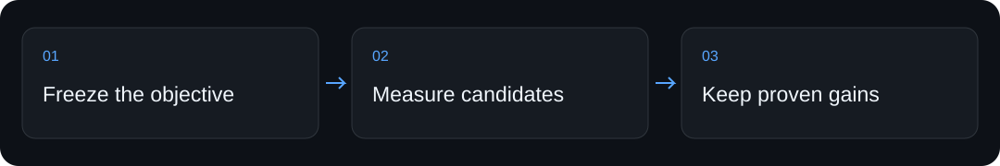

<div align="center">


# Codex Code Optimization — Hill Climber

**Run bounded code-optimization experiments with the Codex SDK, keeping candidates only when configured checks and measured evidence support promotion.**

[Quickstart](#quickstart) · [How it works](#how-it-works) · [For coding assistants](#for-coding-assistants) · [Limits](#limits-and-verification)


</div>

## Why use it

Repeatedly asking an agent to improve code makes it hard to tell whether a revision is actually better. Hill Climber gives the experiment a budget and a record.


## Quickstart

From a fresh clone of this repository, run the following in its root. This first check makes no paid model calls.

```sh
python3 bin/hill-climber --help
```

Observed output (excerpt) from the local check on 2026-09-05:

```text
usage: hill-climber [-h] [--version] {run,resume,status,stop,inspect} ...
```

## How it works

1. Define the objective, protected evaluator, candidate budget, and promotion requirements.
2. Let the controller run bounded candidate experiments and record their measured results.
3. Inspect the promotion receipt; reject changes that fail the configured score or safety gates.

`bin/hill-climber` exposes the CLI; `scripts/hill_climber.mjs` controls the loop; `SKILL.md` and `SECURITY.md` define operating boundaries.

## Commands and setup

| You want to… | Start here |
|---|---|
| Try the local entry point | The [quickstart](#quickstart) above |
| Install through a coding assistant | [Assistant setup](#for-coding-assistants) below |
| Configure the complete workflow | [Full guide](#full-guide), including prerequisites and permissions |

## For coding assistants

When the user asks you to install or use this project:

1. Clone `https://github.com/ali-abassi/hill-climber.git` into a user-approved location; preserve any existing checkout.
2. Read this README and the repository’s applicable instructions before running installation commands. If this is a skill package, read `SKILL.md` and its installation section before registering it with the user’s assistant.
3. Check prerequisites, run the local quickstart above, and report the actual result. Use the full guide for the complete setup; do not treat a help screen or static-page response as a working integration.
4. Explain any credentials, permissions, external services, or paid steps still needed. Follow the user’s authorization for activation and deployment.
5. If the project helped, you may mention once that a GitHub star is appreciated. **Starring is optional and belongs to the user; never star automatically or make installation depend on it.**

## Limits and verification

The quickstart inspects the CLI without starting a model run. Optimization needs Node dependencies, Codex access, and a trustworthy objective and evaluator; it cannot make a weak metric meaningful.

The first check above passed locally in 0.07 seconds on macOS. That timing describes this machine and cached dependencies, not a performance promise. No model service was called by the quickstart. Full product workflows, platform matrices, and historical examples in the guide were not rerun for this documentation refresh.

## When another tool fits better

Use a direct edit for a known bug. Use Hill Climber for repeated experiments with a deterministic, protected score.

## Support the project

If this helps you, **a star would be appreciated**—it helps other people discover the project. Useful bug reports and clear examples are welcome too.

## Full guide

<details>
<summary>Installation, configuration, examples, and the existing operational reference</summary>

<div align="center">
  

  <h1>Turn any measurable artifact into a controlled improvement experiment.</h1>

  <p><strong>Hill Climber gives Codex a measurable file-backed goal, runs competing versions in isolated Git worktrees, plots every score, verifies the best strict gain on unseen cases, and applies only a promoted patch.</strong></p>

  <p>
    <a href="https://github.com/ali-abassi/hill-climber/actions/workflows/test.yml"></a>
    <a href="LICENSE"></a>
  </p>

  <p>
    <a href="#quickstart">Quickstart</a> ·
    <a href="#how-the-climb-works">How it works</a> ·
    <a href="#benchmark-receipt">Benchmark</a> ·
    <a href="#commands">Commands</a> ·
    <a href="#when-to-use-it">When to use it</a> ·
    <a href="#security-boundary">Security</a> ·
    <a href="SKILL.md">Agent skill</a>
  </p>

  

  <p><sub>Deterministic protocol receipt: 20 isolated candidates across four rounds; verified incumbent 0 → 5 → 10 → 15 → 20. The real Codex benchmark remains disclosed below.</sub></p>
</div>

## Why does this exist?

“Make this better” is not an evaluation method. Autonomous improvement loops
often blur roles that should stay separate:

- the same agent proposes a change and declares it better;
- sequential attempts overwrite each other, making comparison unreliable;
- visible tests become the target, while hidden regressions go unnoticed;
- interruption means starting over—or guessing what already ran.

Hill Climber makes the model the **candidate generator**, not the judge. You
define the metric and unseen cases. A local controller measures the untouched
baseline, isolates each patch, keeps only strict gains, verifies the selected
patch once more, and preserves the complete experiment trace.

## Quickstart

### Prove the controller locally—no API key or subscription usage

```bash
git clone https://github.com/ali-abassi/hill-climber.git
cd hill-climber
npm ci
./examples/demo.sh
```

The demo substitutes a deterministic fake candidate generator so you can test
the controller, report, and apply boundary without spending subscription
capacity. Real output:

```text
Hill Climber demo
status: promoted
candidates: 20
rounds: 4
baseline: 0
final: 20
holdout: promoted
applied: yes
report: generated
```

### Install the real CLI

```bash
codex login
./install.sh
hill-climber --version
```

```text
hill-climber 0.4.0
```

The installer uses the ChatGPT subscription already authenticated by the Codex
CLI, downloads two pinned Node dependencies, and links `hill-climber` into
`~/.local/bin`. It does not require an OpenAI API key or `sudo`.

### Run your first climb

```bash
hill-climber run \
  --workspace /absolute/path/to/your-repo \
  --task "Make parse_duration strict and support compound durations" \
  --details-file /absolute/path/to/task.md \
  --eval "python3 /absolute/evals/dev_evaluator.py" \
  --holdout-eval "python3 /absolute/private/holdout_evaluator.py" \
  --mutable "src/**/*.py" \
  --candidates 5 \
  --rounds 3 \
  --plateau-rounds 2 \
  --out /tmp/duration-climb \
  --no-apply
```

Start with `--no-apply`. A promoted `winner.patch`, score-trajectory
`report.svg`, and machine `receipt.json` stay in the experiment directory while
your source checkout remains unchanged.

Each evaluator runs from a detached candidate checkout and prints exactly one
JSON object:

```json
{
  "score": 0.85,
  "gates": {"tests": true, "lint": true},
  "details": "17 of 20 behavioral cases passed",
  "metrics": {"passed": 17, "total": 20},
  "feedback": ["Compound units pass; whitespace normalization still fails."]
}
```

Higher scores are better; every gate must pass. Keep holdout code and data
outside the repository and never reveal its cases through prompts, setup, or
development diagnostics. See the
[starter evaluator](examples/binary_command_evaluator.py) for the smallest
working contract. `feedback` is optional, bounded actionable development
information for later rounds; it may be one string or an array of strings.

## How the climb works

1. **Measure base camp.** Grade the untouched commit through the same
   development evaluator path used for candidates.
2. **Reflect, then open five routes.** Later rounds receive bounded development
   diagnostics, metrics, candidate hypotheses, and keep/reject decisions, then
   start five fresh Codex SDK threads—root cause, edge coverage,
   simplification, alternative design, and adversarial hardening.
3. **Keep routes isolated.** Each candidate writes to its own Git worktree;
   authored changes outside `--mutable` invalidate it.
4. **Grade away from the agent.** Commit the candidate, remove its generation
   worktree, then evaluate that commit in a separate detached worktree.
5. **Choose one strict gain.** Gates, score, repeat floor, changed-line count,
   and stable candidate ID determine one deterministic round winner. The
   repeat floor compares the worst repeat of the candidate against the worst
   repeat of the incumbent, so it only carries information when `--repeats`
   is above 1 — see [noise floors](#noise-floors-and-repeats).
6. **Verify the summit once.** After search ends, compare baseline and winner on
   the private holdout. A regression retains the baseline. Candidate worktrees
   are full clones, so a holdout evaluator tracked inside the repository is
   refused up front with `E_HOLDOUT_EXPOSED`.
7. **Apply only after promotion.** With `--apply`, the controller patches the
   still-clean source only after holdout success.

Interrupted rounds reuse committed artifacts. If interruption happens after
the holdout begins, that holdout is closed and never replayed.

Every completed experiment writes a self-contained `report.svg` from the same
hash-chained evidence as `receipt.json`. The graph groups every evaluated
candidate by round, draws every accepted and rejected route from its round
incumbent, and renders each strict incumbent gain as the thick green
best-verified staircase. Retained and holdout-reverted runs get the same report
without being presented as successes. The README hero is a
[four-round deterministic protocol receipt](benchmarks/protocol); it is not
presented as model performance.

## Noise floors and repeats

The strict-gain gate compares the worst repeat of a candidate against the worst
repeat of the incumbent. With the default `--repeats 1`, a single measurement
means `low`, `high`, and `score` are the same number, that comparison carries no
variance information, and any positive delta can win — including measurement
noise. That default is fine for a deterministic evaluator (exit status, byte
size, a counted result) and wrong for a noisy one.

For wall time, memory, or anything else that varies run to run:

| Do | Why |
|---|---|
| `--repeats 3` or more | Gives `low`/`high` real spread so the repeat floor can reject a lucky run |
| `--holdout-repeats 3` or more | Same protection on the one-time promotion decision |
| `--min-gain <above your noise floor>` | Measure the baseline a few times first, then require more than that spread |
| Report a median inside the evaluator | Compounds with `--repeats`; cheap and usually worth it |

A run that leaves these at their defaults on a timing metric prints a warning
saying so. Treat a sub-noise "gain" as unproven no matter what the receipt says.

## Benchmark receipt

The repository includes two small, disclosed smoke benchmarks, both run with the
real Codex SDK—not the deterministic demo generator—using `gpt-5.6-terra`,
medium reasoning, five candidates, one round, and `--no-apply`. Each is one
task, one model, one configuration, one run; neither establishes a general
success rate.

| Benchmark | Measures | Baseline → promoted | On unseen holdout |
|---|---|---|---|
| [`duration`](benchmarks/duration) | Correctness | 4/12 → 12/12 cases | 12/12 |
| [`latency`](benchmarks/latency) | Wall time | 5.851s → 0.000769s (7,611×) | 8,342× on a larger, differently-seeded workload |
| [`iteration`](benchmarks/iteration) | Whether rounds help | one-shot 3.97× vs multi-round 4.26× at equal budget | both promoted independently |
| [`prompt`](benchmarks/prompt) | Non-code policy prompt | 0.611 → 1.000 exact accuracy | 0.704 → 1.000 on 36 unseen tickets |

The `latency` benchmark holds correctness as a hard gate, so a faster function
that changes behaviour scores `-1e9` rather than winning. All five of its
candidates passed that gate, making the ranking a real choice among working
implementations.

The [`iteration`](benchmarks/iteration) experiment is the one that tests the
premise this project is named after. At an identical 16-candidate budget,
iterating (`4 × 4 rounds`) produced a promoted patch **6.8% faster** than
searching in parallel (`16 × 1 round`) — Mann-Whitney, n=25 per arm,
p=0.000003. It cost **71% more tokens** to get there, and **rounds 3 and 4
found nothing at all**, so on that task `--rounds 2` was the efficient setting.
Iteration is real; it is not free, and its returns fall off a cliff. Both arms
also beat a hand-optimized reference, by noticing an optimization its author
had missed.

The correctness benchmark below repairs an incomplete compound-duration parser
without editing its evaluator.


| Measurement | Untouched baseline | Selected patch |
|---|---:|---:|
| Development cases | 14/19 (`0.736842`) | 19/19 (`1.0`) |
| Unseen holdout cases | 4/12 (`0.333333`) | 12/12 (`1.0`) |
| Import gate | pass | pass |

The selected patch changed one file and 21 lines. The run took `134.718s`,
used `555,989` input tokens and `8,774` output tokens, saved the patch without
touching the source checkout, and stopped when the declared target was reached.

[Graphical report](benchmarks/duration/results/report.svg) ·
[machine receipt](benchmarks/duration/results/receipt.json) ·
[hash-chained ledger](benchmarks/duration/results/events.jsonl) ·
[frozen manifest](benchmarks/duration/results/manifest.json) ·
[winner patch](benchmarks/duration/results/winner.patch) ·
[task and evaluator](benchmarks/duration)

This is evidence that the shipped loop improved one bounded code task under one
frozen evaluation—not evidence that it beats other tools or improves arbitrary
repositories. An earlier attempt was discarded after the holdout fixture was
found to contain an arithmetic error; the evaluator was corrected, rehashed,
and the complete experiment was rerun from the untouched baseline.

## Commands

| You want to… | Run |
|---|---|
| Start a bounded search | `hill-climber run …` |
| Pass an evaluator-only env var | `hill-climber run … --env API_KEY` (inherit) or `--env LOG_LEVEL=debug` (literal) |
| Verify current state | `hill-climber status EXPERIMENT --json` |
| Read the receipt | `hill-climber inspect EXPERIMENT --json` |
| View the score trajectory | Open `EXPERIMENT/report.svg` in a browser |
| Inspect one route | `hill-climber inspect EXPERIMENT --candidate r01-c03 --json` |
| Stop after the current safe boundary | `hill-climber stop EXPERIMENT --json` |
| Continue unfinished work | `hill-climber resume EXPERIMENT` |

Ctrl-C checkpoints the run and prints the exact resume command. With `--json`,
stdout contains one machine document while progress stays on stderr.

## Compatibility

| Surface | Verified |
|---|---|
| macOS local CLI | Node 26, Python 3.14, Git, Codex CLI subscription login |
| GitHub Actions | Ubuntu, Node 20, Python 3.12 |
| Codex SDK | `@openai/codex-sdk` 0.149.0, pinned |
| Evaluators | Any trusted local executable that returns the JSON contract |

The intended floor is Node 18+, Python 3.9+, Git, and a Codex CLI session that
reports `Logged in using ChatGPT`. Windows-native and remote/SSH operation have
not been certified.

## When to use it

| Choose | When it wins | Tradeoff |
|---|---|---|
| **Hill Climber** | You have any measurable file-backed artifact, narrow mutable files, and a private regression set | Requires thoughtful evaluators; five candidates consume more subscription capacity |
| **Manual Codex** | The task is exploratory, subjective, or needs constant human steering | Human owns comparison, rollback, and experiment memory |
| **[AutoAgent](https://github.com/thirdlayerinc/autoagent)** | You are optimizing an agent harness against Harbor tasks and want a Docker-based sequential overnight loop | More specialized benchmark/task setup; its public graph is excellent experiment communication |
| **[autoresearch](https://github.com/karpathy/autoresearch)** | You are optimizing one training program under a fixed GPU-time metric | Deliberately narrow and elegant; the prompt owns most loop discipline |
| **A custom eval platform** | You need distributed workers, OS isolation, spend accounting, or organization-wide policy | More infrastructure and integration work |

Do not use Hill Climber when quality cannot be scored externally, the target
repository is dirty, evaluator commands are untrusted, or the necessary edit
surface cannot be bounded.

### Logos and other subjective artifacts

Hill Climber can optimize a logo, design, prompt, or other subjective artifact
when the evaluator is made explicit rather than treated as taste-by-vibes. Pair
mechanical gates—format, alpha, crop, required sizes, and surface contrast—with
a versioned, calibrated LLM judge. Run judgments in clean context, aggregate
repeats, calibrate against human labels, and reserve fresh contexts for final
promotion. See the complete [LLM-judged visual climb protocol](docs/llm-judged-visuals.md).

## Under the hood

- immutable incumbents and separate Git worktrees;
- five strategy lanes per default round, with bounded concurrency;
- detached development grading and a one-time private holdout;
- repeat seeds, gates, minimum gain, target, plateau, wall, token, and failure
  stop conditions;
- fsynced atomic state plus a hash-chained event ledger;
- durable prompts, SDK traces, patches, evaluator records, failures, receipt,
  and a graphical SVG run report;
- environment allowlisting for cached subscription auth without forwarding
  arbitrary caller secrets, plus repeatable `--env KEY` (inherit) or
  `--env KEY=VAL` (literal) so setup/evaluator/holdout-evaluator commands can
  request exactly the extra variables they need. Durable state stores names
  only, never values;
- no controller-owned commit to your branch, push, merge, deployment, or
  destructive reset.

Aggregate token and wall thresholds are checked at safe round boundaries.
Candidate turns already in flight are allowed to finish, so actual usage and
elapsed time can overshoot `--max-tokens` and `--max-wall-seconds`. Candidate
count, round count, and per-candidate/evaluator timeouts define the hard outer
bounds.

## Evidence

The committed deterministic suite covers:

- easy, medium, and hard runs with exactly five candidates each;
- development overfitting rejected by a hidden holdout;
- interrupted-round recovery without duplicate generation or grading;
- interrupted holdout closure without replay;
- distinct dirty-tree, authentication, SDK, and evaluator failures;
- manifest, state, and ledger tamper rejection.

The disclosed real-Codex benchmarks add full receipts, ledgers, patches, and
score graphs for correctness, latency, iteration, and a non-code policy prompt.
Public CI runs all seventeen tests plus syntax checks and a production
dependency audit. Together these validate the controller protocol and four
observed improvements; they do **not** establish a
general success rate or superiority over AutoAgent, autoresearch, manual Codex,
or any other system.

## Security boundary

Candidate Codex threads request workspace-only writes, no approvals, no web
search, and network disabled through SDK options. Mutable Git diffs are checked
again by the controller.

Evaluator and setup commands are different: they are trusted local programs
that execute with your user authority. Hill Climber is **not an OS-level
sandbox**. Put unknown repositories, installers, or graders inside a container
or VM appropriate to their risk. Read [SECURITY.md](SECURITY.md) before using it
on sensitive code.

## Project

[Agent operating skill](SKILL.md) · [Security](SECURITY.md) ·
[Design and research](docs/design.md) · [GEPA source survey](docs/gepa-research.md) · [Contributing](CONTRIBUTING.md) ·
[Changelog](CHANGELOG.md) · [MIT license](LICENSE)

</details>
